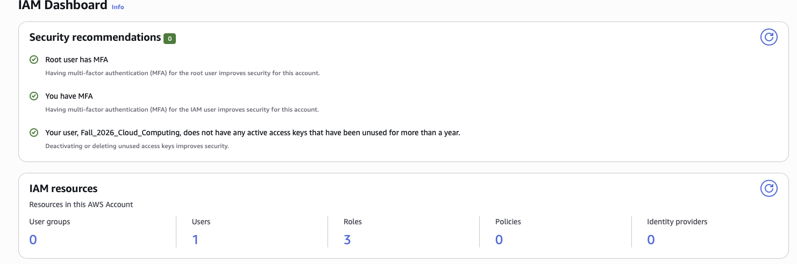
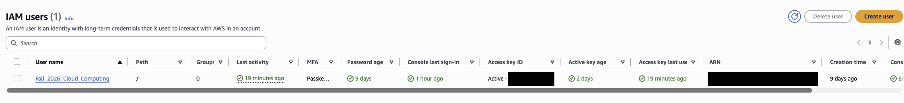
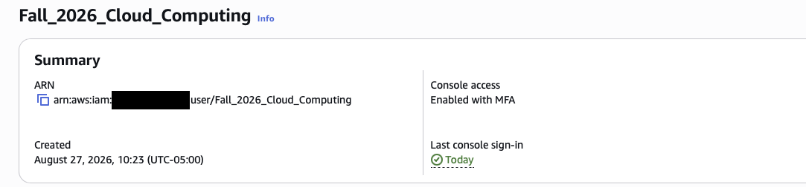

# Lab 1 - Step 01: AWS Account Setup, IAM, and MFA

**Student:** William Schoen  
**Course:** Cloud Computing  
**Date:** September 5, 2026

## Objective and outcome

I used my existing AWS account, secured the root user and my IAM user with MFA, and configured an IAM access key for command-line access.

## 1. Root user MFA

The IAM dashboard confirms that the root user has MFA enabled.

## 2. IAM lab user

The IAM Users list shows my lab user, Fall_2026_Cloud_Computing.

## 3. IAM user MFA

The user summary confirms that console access is enabled with MFA.

## Access key confirmation

An IAM access key was created and successfully used for AWS CLI authentication in Step 03. No key values are included in this report.

## Reflection

Multi-factor authentication (MFA) protects the AWS root user by requiring an additional verification step beyond a password. This is especially important because the root user has full control over the account. For everyday tasks, IAM users should have only the permissions they need, following the principle of least privilege. This limits the damage that accidental mistakes or compromised credentials can cause. Together, root user MFA and limited IAM permissions help protect cloud resources, sensitive data, and the account from unauthorized use.
