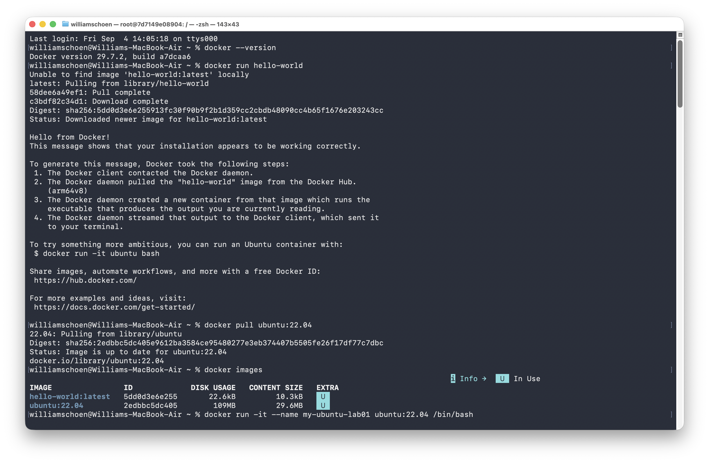
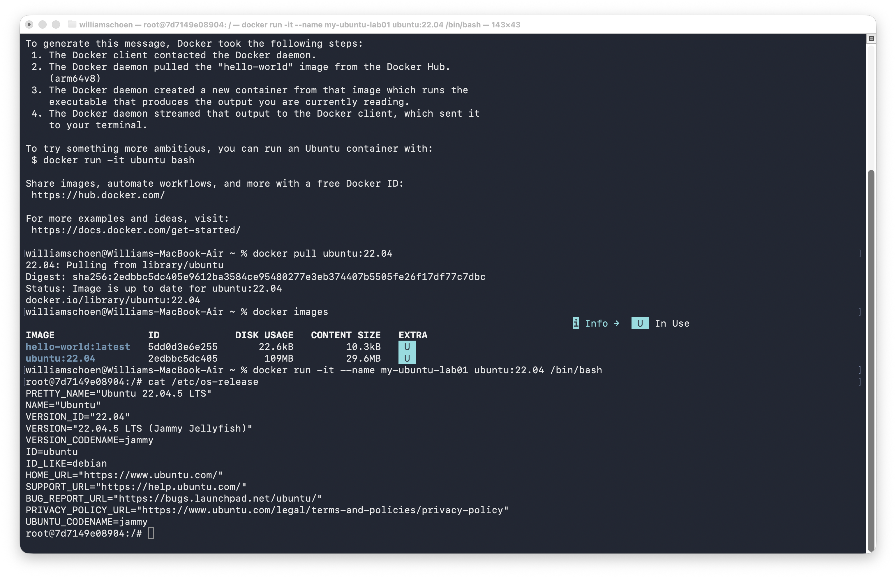
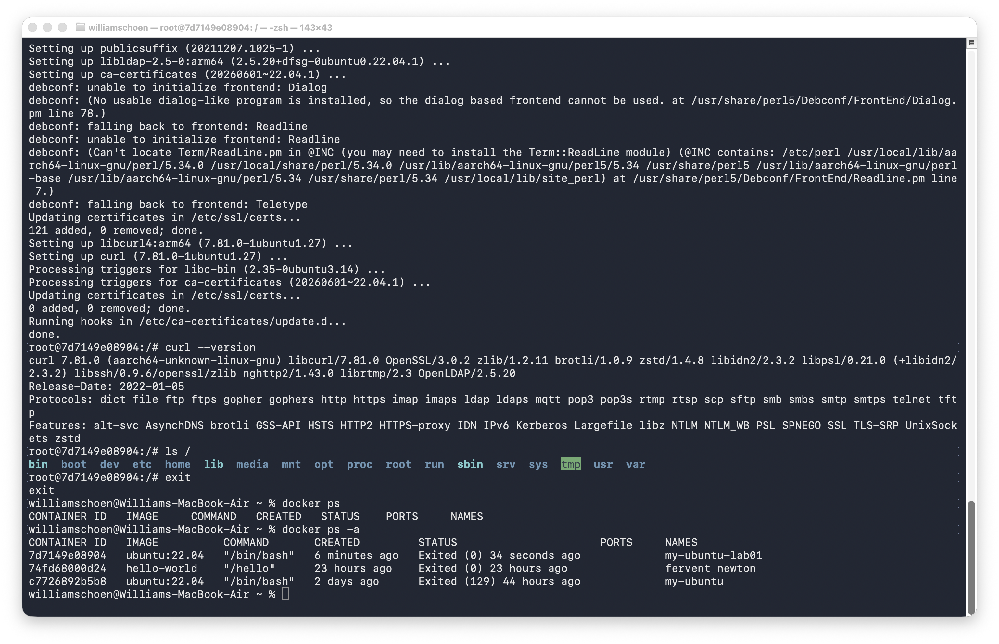
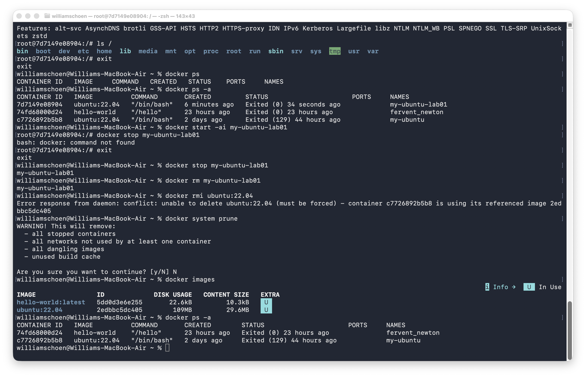

# Lab 1 - Step 02: Docker and Linux Container Setup

**Student:** William Schoen  
**Course:** Cloud Computing  
**Date:** September 5, 2026

## Objective and outcome

I verified Docker Desktop on my Apple Silicon Mac and used Ubuntu 22.04 to practice working inside a Linux container.

## 1. Docker installation and Hello World

The screenshot shows Docker version 29.7.2 and the successful Hello from Docker! test output. It also shows the Ubuntu image available locally.

## 2. Ubuntu container

I created the container my-ubuntu-lab01 from ubuntu:22.04. The output of cat /etc/os-release confirms Ubuntu 22.04.5 LTS inside the container.

## 3. Container exploration and state before removal

I installed and verified curl, listed the root filesystem, and exited the container. docker ps shows no running containers, while docker ps -a includes the stopped lab container.

## 4. Restart and removal

I restarted the existing container and subsequently removed my-ubuntu-lab01. The final docker ps -a output no longer lists it. I learned that Docker management commands belong in the Mac shell: running docker stop inside the container produced a command-not-found error. The Ubuntu image was retained, and the prune confirmation was declined.

## Reflection

An image is a read-only blueprint used to create containers. It contains the operating system files and any included software. A container is an isolated environment created from that image, with its own writable layer for changes such as installing programs or creating files. Docker allows me to experiment with Ubuntu and run Linux commands without installing Ubuntu as the main operating system on my Mac.
