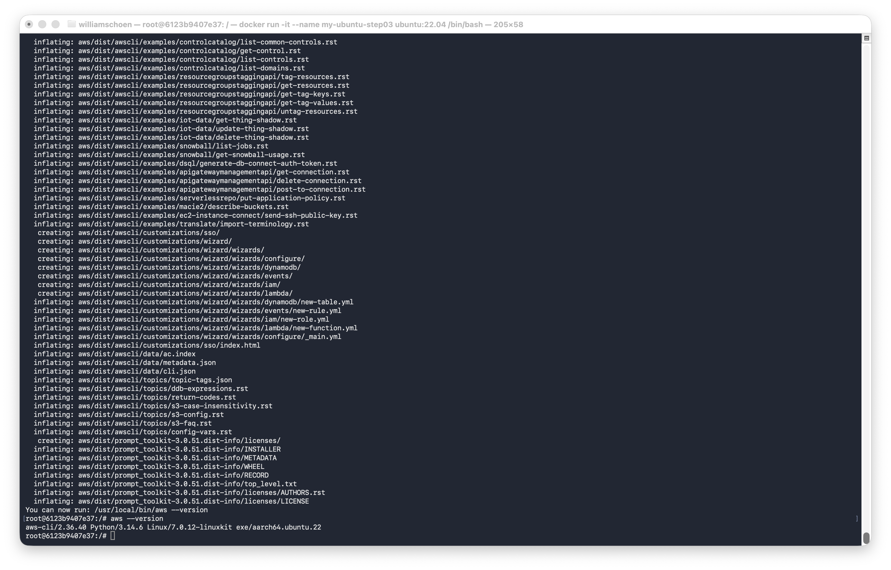
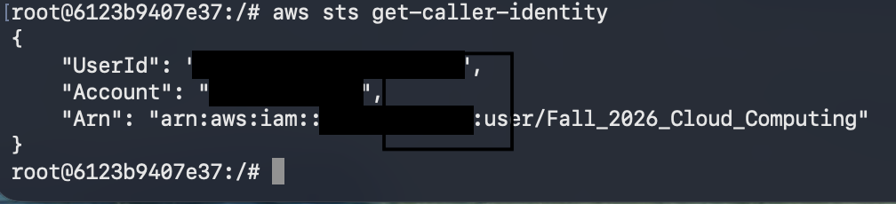
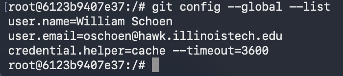
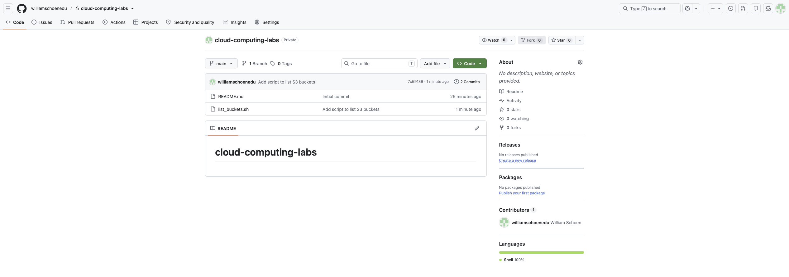

# Lab 1 - Step 03: AWS CLI and GitHub in a Docker Container

**Student:** William Schoen  
**Course:** Cloud Computing  
**Date:** September 5, 2026

## Objective and outcome

I created a fresh Ubuntu container named my-ubuntu-step03, installed the AWS CLI and Git tools, authenticated to AWS with my IAM user, and pushed a shell script to GitHub.

## 1. AWS CLI installation

The output of aws --version confirms AWS CLI 2.36.40 installed for Linux ARM64 (aarch64) inside Ubuntu.



## 2. AWS authentication

The aws sts get-caller-identity response confirms that the CLI uses my IAM lab user, Fall_2026_Cloud_Computing, rather than the AWS root user.



## 3. Git identity

The Git configuration shows my name and college email address. The credential helper caches GitHub credentials in memory for one hour.



## 4. Script committed and pushed to GitHub

The repository screenshot shows list_buckets.sh and the commit Add script to list S3 buckets. I ran the script successfully; it printed its heading and returned without listing any buckets.



## Script and persistence

The script uses `aws s3 ls` to list existing S3 buckets. The container retains installed tools and AWS configuration when stopped; it can be reopened with `docker start -ai my-ubuntu-step03`. The GitHub token cache is temporary.

[View the course repository](https://github.com/williamschoenedu/cloud-computing-labs)

```bash
#!/bin/bash
echo "Listing S3 buckets in your AWS account:"
aws s3 ls
```

## Reflection

AWS credentials and GitHub tokens should never be committed to a repository because they can allow others to access cloud resources or private code. Even a private repository may be shared, made public, or accessed through a compromised account. Deleting a secret from a file does not remove it from Git history. Credentials should therefore be stored outside the repository, and sensitive files should be excluded using .gitignore before they are tracked.
