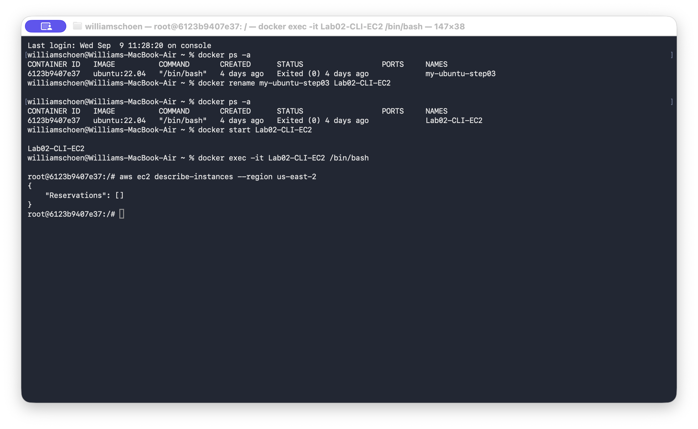
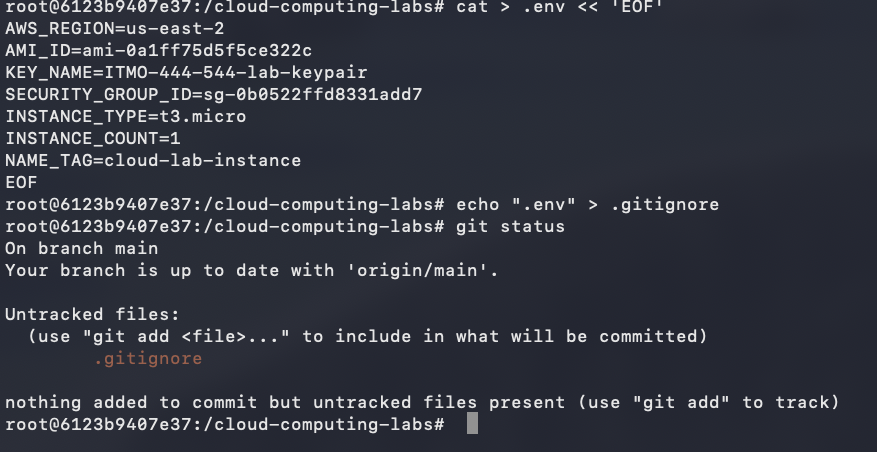
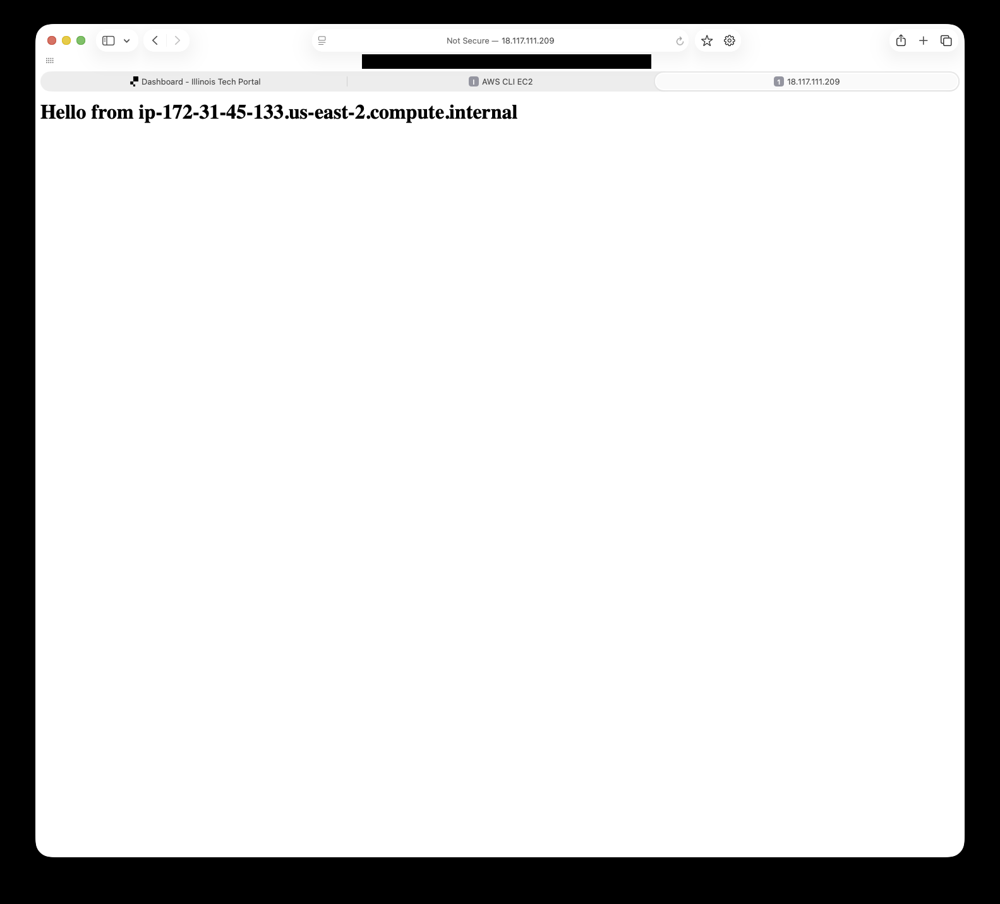
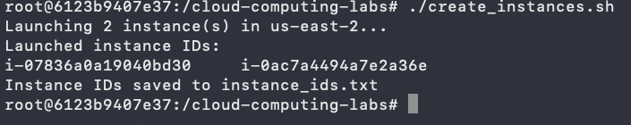
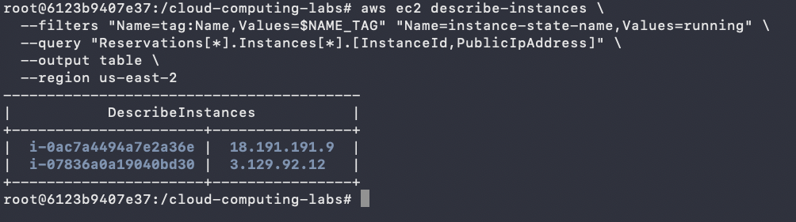
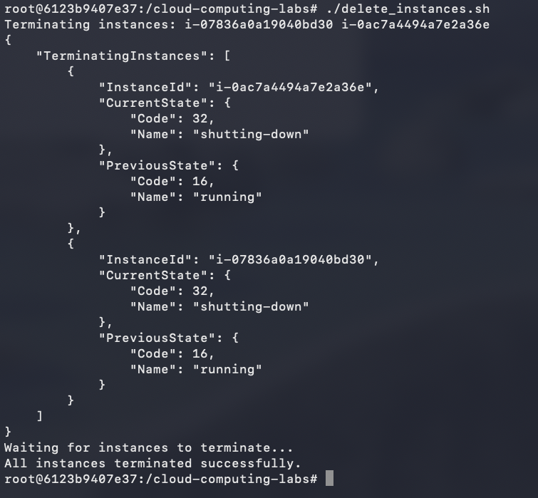

# Lab 02 - EC2 Automation with Bash Scripts & AWS CLI

**Author:** WilliamSchoen  
**Course:** Cloud Computing  
**Repository:** cloud-computing-labs  
**Report date:** September 12, 2026

## Objective and outcome

I used Bash scripts and the AWS CLI to automate the creation and termination of EC2 instances. Configuration was stored in a local environment file. Two instances were launched, verified, and successfully terminated after testing.

## 1. Container setup and AWS connection

I reused and renamed my Ubuntu container from Lab 1. The initial AWS query confirmed access to the Ohio region and returned no existing instances.

## 2. Environment configuration and Git protection

I stored the deployment settings in a local environment file and added it to Git's ignore rules. The screenshot shows that the environment file is absent from the untracked files list. The initial configuration used one instance; the later automation test used two.

## 3. Web-server verification

For the earlier web-server example, I opened the instance's public address in a browser. The Hello message confirms that the web server responded successfully. This was a separate test from the two-instance automation below.

## 4. Automated instance creation

The creation script successfully launched two EC2 instances in the Ohio region and saved their IDs to a local tracking file for cleanup.

## 5. Running instance verification

The AWS query returned two running instances and their assigned public IP addresses, confirming that the automated launch succeeded.

## 6. Automated termination

The deletion script targeted both recorded instances, requested termination, and waited for completion. The final message confirms that all instances terminated successfully.

## Reflection

- Environment files should be excluded from Git because they contain deployment-specific settings and may contain sensitive credentials. Even a private repository can be shared, made public, or accessed through a compromised account. Deleting a file later does not remove it from Git history. Keeping the real environment file outside version control and sharing a template with placeholders makes the configuration reusable while protecting sensitive information.
